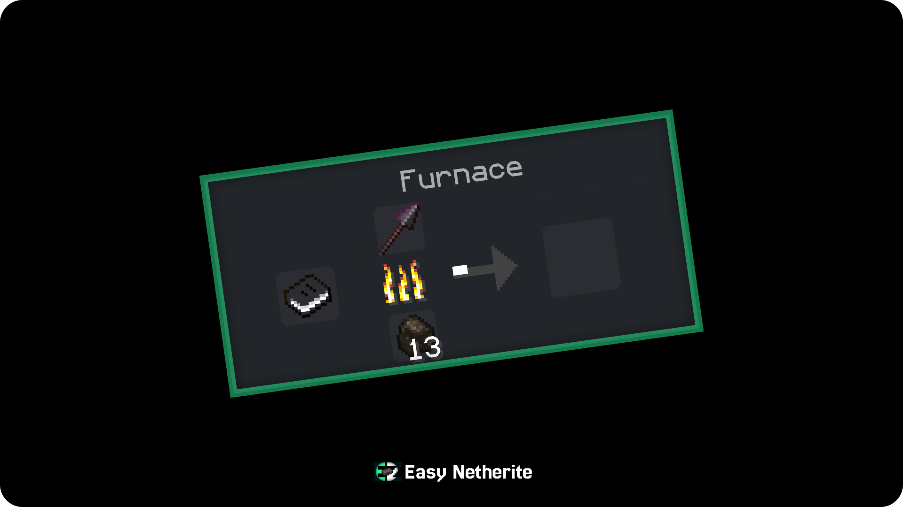
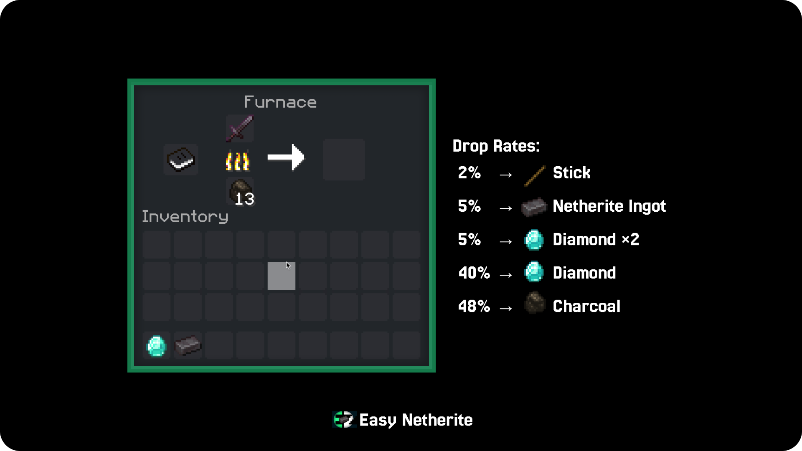

# Easy Netherite

**A balanced Minecraft Java datapack that makes Netherite progression easier, faster, and more rewarding.**


---

## Overview

Easy Netherite is a **Java Edition datapack** designed to improve Netherite progression without making it feel free or broken. Instead of the old system that always returned the same result, Easy Netherite now uses a **balanced drop system** with different rewards and clear drop chances.

It is made for players who want a smoother survival experience while still keeping some grind, balance, and fun.

---

## Features

* **Balanced drop system** with multiple rewards
* **Smelting-based bonus rewards**
* **Clear drop rates** for each outcome
* **Sound effects** for rare rewards
* **No unrealistic coal-to-Netherite recipes**
* Built for **survival-friendly progression**

---

## Drop Rates

When the bonus system triggers, the reward pool is:

* **2%** → Stick
* **5%** → Netherite Ingot
* **5%** → Diamond ×2
* **40%** → Diamond ×1
* **48%** → Charcoal ×1

> Only one reward is given per roll.

---

## What Changed

### Removed

* Coal Block → Netherite Block
* Coal → Netherite Ingot

These recipes were removed to improve balance and avoid unrealistic resource conversion.

### Updated

* Reworked the old smelting system
* Added a structured reward system with non-overlapping drop chances
* Improved feedback with sounds for rare rewards
* Prevented reward loss when processing multiple smelts

---

## Installation

1. Download the datapack `.zip` file.
2. Place it inside your world folder:

   ```
   .minecraft/saves/<your world>/datapacks/
   ```
3. Start your world.
4. Run:

   ```mcfunction
   /reload
   ```
5. Check that the datapack is loaded:

   ```mcfunction
   /datapack list
   ```
   
---

## Compatibility

* **Minecraft Java Edition**
* Designed for **1.21.11 / 26.1.X**
* Uses datapack functions and recipes

---

## Notes

* This datapack is meant to feel **easy**, but not instant.
* It keeps Netherite rewarding while reducing unnecessary grind.
* The old system has been replaced with a more controlled and balanced experience.

---

## Preview

If you want to show the system visually, add screenshots here:

```md


```

---

## Development

This project is structured like a standard Java datapack:

```text
EasyNetherite/
├── assets/
│   ├── banner.png
│   ├── drop-rates.png
│   └── preview.png
│
├── data/
│   ├── easynetherite/
│   │   ├── advancement/
│   │   │   └── intro.json
│   │   ├── function/
│   │   │   ├── intro.mcfunction
│   │   │   ├── load.mcfunction
│   │   │   ├── reward.mcfunction
│   │   │   └── tick.mcfunction
│   │
│   └── minecraft/
│       ├── recipe/
│       │   └── smelt_netherite.json
│       └── tags/
│           └── functions/
│               ├── load.json
│               └── tick.json
│
├── LICENSE.txt
├── pack.mcmeta
├── pack.png
└── README.md
```

---

## History

- Initial release: Minecraft 1.16 (Nov 2020)
- Major rework: v3.0 (Balanced drop system)

## Changelog Highlights

### v3.0

* Removed coal-based Netherite recipes
* Rebalanced the bonus drop system
* Added a structured reward table
* Improved gameplay feedback
* Refined progression for survival players

---

## License

This project is licensed under the **MIT License**. See the `LICENSE.txt` file for details.

---

## Credits

Created for Minecraft players who want a cleaner, more balanced Netherite experience.

---

## Support

If you enjoy the datapack, consider leaving feedback, a star, or a comment on the project page.
